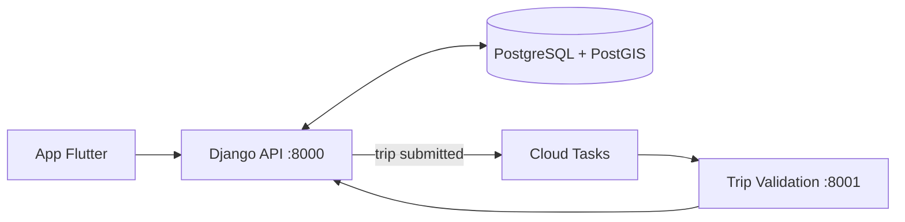

# CAP Projet Undrive

Plateforme d'éco-mobilité gamifiée. L'application détecte les trajets bas carbone, calcule les économies de CO₂ associées et les convertit en jetons utilisables chez des partenaires locaux.

Projet réalisé dans le cadre du Cycle d'Approfondissement Projet (CAP) à l'[ESIEA](https://www.esiea.fr/).

## Équipe

- [@Yoann-CORGNET](https://github.com/Yoann-CORGNET)
- [@ijScrypt](https://github.com/ijScrypt)
- [@K4yan0](https://github.com/K4yan0)
- [@DIDIer5454](https://github.com/DIDIer5454)
- [@GrizruleH](https://github.com/GrizruleH)
- [@ElieFellous](https://github.com/ElieFellous)

## Stack

| Catégorie  | Technologies |
|------------|--------------|
| Langages   |     |
| Front-end  |    |
| Back-end   |       |
| Infra      |      |
| DevOps     |     |

## Architecture

- **Mobile** : application Flutter (Android, iOS, Web), GPS et accéléromètre, carte OpenStreetMap.
- **API** : Django REST Framework, authentification Google OAuth2 + JWT, persistance PostgreSQL/PostGIS.
- **Validation des trajets** : microservice FastAPI déclenché de manière asynchrone via GCP Cloud Tasks.
- **Infrastructure** : Cloud Run multi-environnements (dev, prod, preview par PR), provisionné en Terraform, livré via GitHub Actions.

## Fonctionnalités

- Détection automatique du mode de transport (marche, vélo, voiture) à partir des capteurs.
- Suivi de trajets en arrière-plan et historique cartographié.
- Marketplace de récompenses : portails partenaires, codes promo, cadeaux physiques.
- Gamification : streaks, classements, dashboard CO₂, quiz éducatifs.
